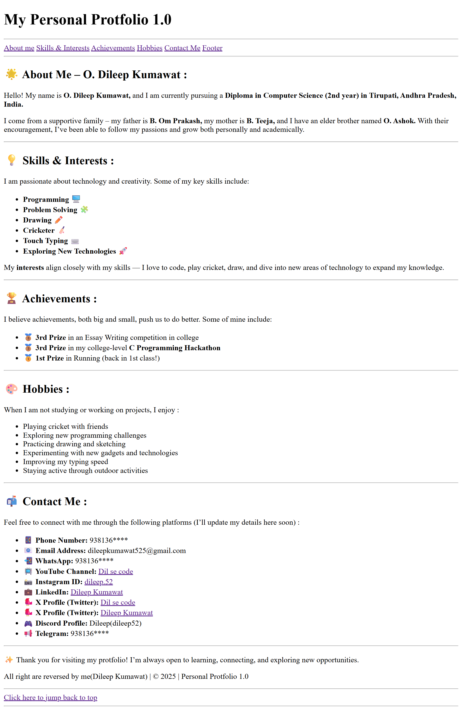

# 🌐 Personal Portfolio 1.0

This is my **first portfolio website**, built with pure **HTML**. It introduces me, my skills, achievements, hobbies, and contact details.
The project is designed to be simple, clear, and beginner-friendly — a perfect starting point for anyone learning HTML basics.

🔗 **Live Demo:** [Click here to view](YOUR_LIVE_LINK_HERE)

📸 **Preview:**


---

## 📖 Features

* About Me section with personal introduction
* Skills & Interests list
* Achievements showcase
* Hobbies & activities
* Contact details with links to social media profiles
* Easy navigation with anchor links
* Footer with copyright info

---

## 🏷️ HTML Tags Used & Their Purpose

Here’s a breakdown of the key HTML tags used in this project and what they do:

| Tag               | Usage in Project                         | Purpose                                            |
| ----------------- | ---------------------------------------- | -------------------------------------------------- |
| `<!DOCTYPE html>` | Declares the document as HTML5           | Tells the browser this is an HTML5 document        |
| `<html>`          | Wraps the whole content                  | Root of the HTML page                              |
| `<head>`          | Metadata, title                          | Contains info about the page (not visible content) |
| `<title>`         | `My Portfolio 1.0`                       | Sets the title shown in the browser tab            |
| `<meta>`          | Charset & viewport                       | Helps with encoding and responsive design          |
| `<body>`          | Main content                             | Everything visible on the page                     |
| `<h1>` - `<h6>`   | Page headings                            | Defines headings of different levels               |
| `<p>`             | Paragraphs                               | Adds text blocks                                   |
| `<b>`             | Bold text                                | Highlights important words                         |
| `<i>`             | Italic text                              | Adds emphasis                                      |
| `<u>`             | Underlined text                          | Underlines text                                    |
| `<sup>` / `<sub>` | Not used here, but mentioned in comments | For superscript/subscript text                     |
| `<ul>` / `<ol>`   | Lists of skills, hobbies, etc.           | Unordered (bulleted) / Ordered (numbered) lists    |
| `<li>`            | Items inside lists                       | Each bullet/number item                            |
| `<a>`             | Links to sections & social media         | Anchor tag for navigation and external links       |
| `<div>`           | Section containers                       | Groups content into blocks                         |
| `<hr>`            | Horizontal line                          | Separates sections visually                        |
| `<!-- -->`        | Comments                                 | Adds notes in the code without showing on the page |

---

## 🚀 How to Use / Run

1. Clone or download the repository

   ```bash
   git clone https://github.com/YOUR_USERNAME/YOUR_REPO_NAME.git
   ```
2. Open `index.html` in your browser
3. That’s it! 🎉

---

## 📚 Learning Outcome

This project helps beginners understand:

* Structuring a webpage with **semantic HTML**
* Using headings, paragraphs, and lists properly
* Creating navigation with **anchor tags**
* Linking external sites (YouTube, Instagram, LinkedIn, etc.)
* Organizing code with **comments**

---

## 📝 License

This project is created by **Dileep Kumawat**.
You are free to learn from it, but please give credit if you use it.
